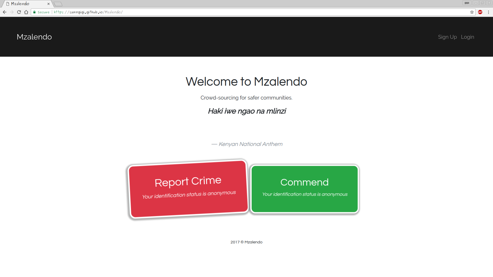

Mzalendo Live Crime reporting platform
=======================

**This simple crime & corruption reporting website where any person can report a crime or corruption incident that is currently happening now or happened earlier.

The reports are then reflected as live data in the Mzalendo community page. Data would be broken down into simple & understandable categories.**

##Specifications
-----------------
- It can allow a user to submit a crime/corruption incident or a commendation.

- It would allow a user to sign-up & login. (Note that this is a mock-up/simulation)

- It would allow a user access the community page through a login.

- It simulates the visualization of data that would be reported. This is implemented through a JavaScript slip function.

### What we used
This site was build using  
1. `HTML`
2. `CSS`
3. `JavaScript`
4. `jQuery`
5. `Animate.css`
6. `Bootstrap`.

Click [here](https://samngigi.github.io/Mzalendo/) to see the site.

------------

#### Credits
Kambo Martha Marina
------------

License
-------

MIT License

Copyright (c) [2017] [Sam Ngigi]

Permission is hereby granted, free of charge, to any person obtaining a copy
of this software and associated documentation files (the "Software"), to deal
in the Software without restriction, including without limitation the rights
to use, copy, modify, merge, publish, distribute, sublicense, and/or sell
copies of the Software, and to permit persons to whom the Software is
furnished to do so, subject to the following conditions:

The above copyright notice and this permission notice shall be included in all
copies or substantial portions of the Software.

THE SOFTWARE IS PROVIDED "AS IS", WITHOUT WARRANTY OF ANY KIND, EXPRESS OR
IMPLIED, INCLUDING BUT NOT LIMITED TO THE WARRANTIES OF MERCHANTABILITY,
FITNESS FOR A PARTICULAR PURPOSE AND NONINFRINGEMENT. IN NO EVENT SHALL THE
AUTHORS OR COPYRIGHT HOLDERS BE LIABLE FOR ANY CLAIM, DAMAGES OR OTHER
LIABILITY, WHETHER IN AN ACTION OF CONTRACT, TORT OR OTHERWISE, ARISING FROM,
OUT OF OR IN CONNECTION WITH THE SOFTWARE OR THE USE OR OTHER DEALINGS IN THE
SOFTWARE.
